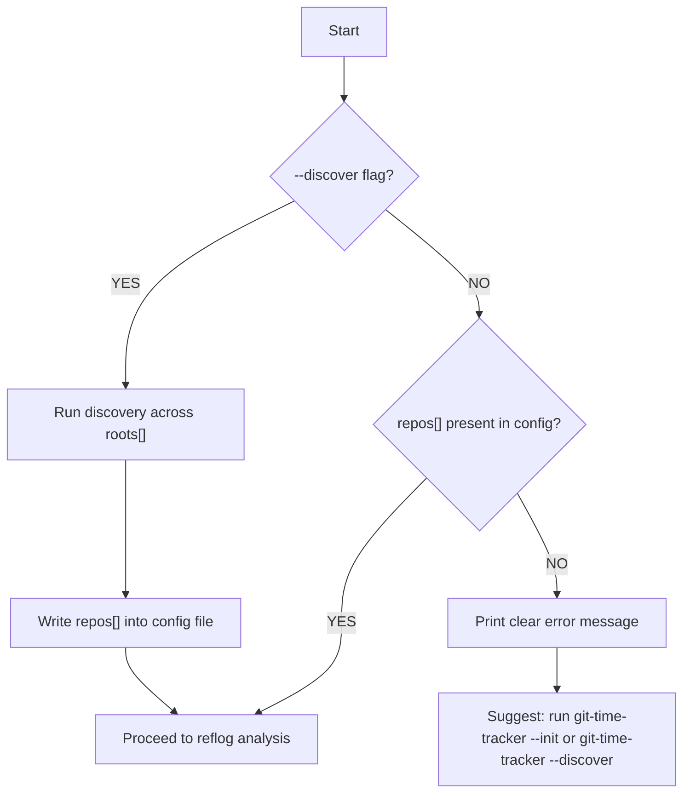
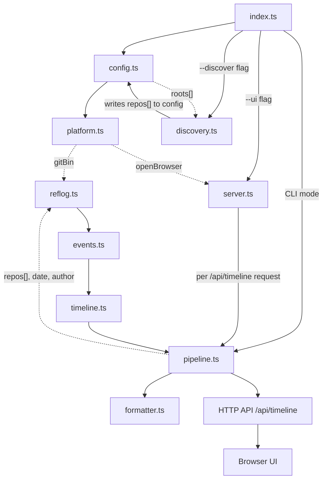
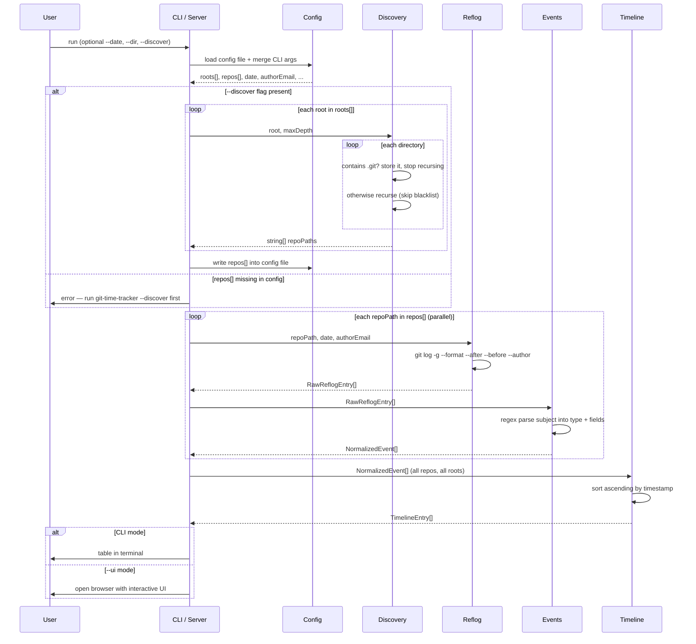
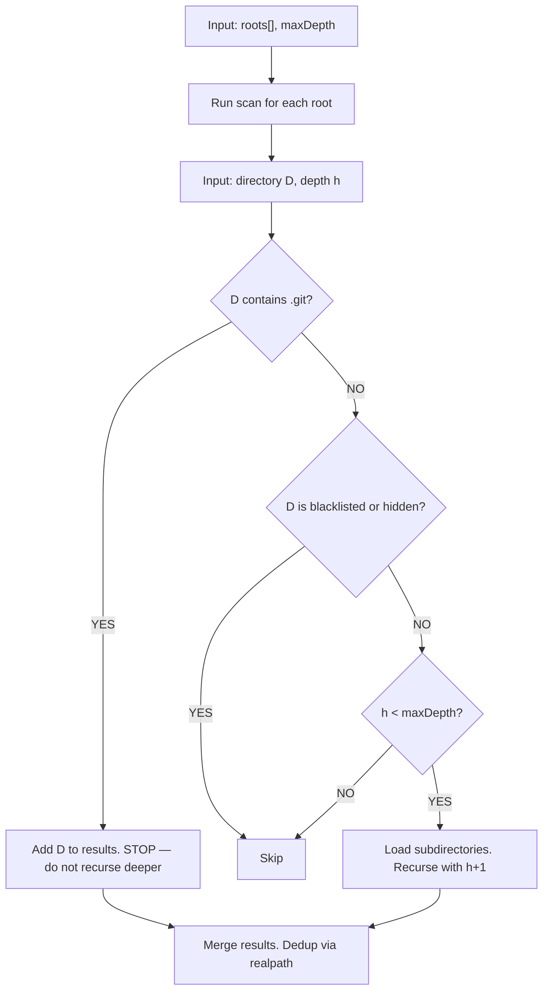

# git-time-tracker — Architecture Design

> A tool for building a daily work timeline from git history across multiple repositories.

---

## 1. Existing Solutions Research

| Tool | Description | Why It Falls Short |
|---|---|---|
| [git-standup](https://github.com/kamranahmedse/git-standup) | Walks directories with git repos, shows commits per day/author | Tracks **commits only** (no checkouts or branch switches). Reflog support [was never implemented](https://github.com/kamranahmedse/git-standup/issues/79). Shell script. |
| [Git Timetrack](https://www.gittimetracker.com/) | Logs commits, checkouts, merges to a local file | Requires **upfront setup** (git hooks). Not retroactive — no data without hooks already in place. |
| GitDailies / Gitmore | Cloud dashboards for team metrics | Cloud-based, focused on team activity and GitHub API, not local history. |

**No existing tool** covers the required combination: retroactive analysis without prior setup, local/offline, commits **and** branch switches in a single timeline, multi-repo traversal, Node.js (deterministic, testable). Building a custom tool is justified.

---

## 2. Technical Foundation — Why `git reflog`

`git log` only shows commits. To capture **branch checkouts** we need `git reflog`, which records **every HEAD movement**:

```
abc1234 HEAD@{2026-04-22 09:15:00 +0200}: checkout: moving from main to feature/auth
def5678 HEAD@{2026-04-22 10:32:00 +0200}: commit: Add JWT validation
ghi9012 HEAD@{2026-04-22 10:45:00 +0200}: commit (amend): Add JWT validation with tests
```

Reflog captures all relevant event types:
- `commit` — standard commit
- `commit (amend)` — amended commit
- `commit (initial)` — first commit in a repository
- `commit (merge)` — merge commit (e.g. after resolving a conflict)
- `checkout: moving from <A> to <B>` — branch switch (including `git switch`); a detached-HEAD checkout looks the same but `<B>` is a raw 40-char SHA instead of a branch name
- `merge <branch>: <msg>` — branch merge (fast-forward or HEAD-move record)
- `rebase -i (finish)` — completed rebase

Date filtering uses `git log -g` (log with reflog walk), which supports `--after` / `--before`.

---

## 3. Decisions

| Area | Decision | Rationale |
|---|---|---|
| Author filtering | Always current `git config user.email` | Tool is for personal daily overview, not team reporting |
| Timezone | Local time from `%ai` offset (`+0200`), no conversion | Consistent with `git reflog`, zero room for error |
| RESET events | **Exclude** | Noise — reset is an internal operation, not a work milestone |
| Installation and UI | CLI + optional web UI mode | CLI for automation, `--ui` for interactive date browsing |
| Empty day output | Explicit message | Silent exit is indistinguishable from an error |
| Multiple root directories | **Single instance, config file** | Unified timeline; two instances = redundancy with no benefit |
| Cross-platform | OS detection via `process.platform`, abstracted in `platform.ts` | All other modules are OS-agnostic |
| Discovery vs. analysis separation | **Explicit `--discover` flag, repos stored in config** | Discovery is slow; analysis runs every invocation. Explicit separation avoids automatic invalidation logic. |
| Language | **TypeScript** | Type safety, better DX, interfaces match architecture doc |
| Module syntax | **ESM** (`import`/`export`) | What the team already writes |
| Module output | **CommonJS** (compiled by `tsc`) | Jest works natively, no experimental flags, no `.js` extension issue in imports |
| Test runner | **Jest + ts-jest** | Native `jest.mock()` for `child_process`/`fs`; full type checking in tests; zero extra config |

### 3.1 UI Choice

**Chosen:** CLI mode for automation/scripting, plus `--ui` flag for interactive use. Server uses the built-in `node:http` module — no extra dependencies. Browser opening is handled by `platform.ts` with a waterfall of available commands per OS.

### 3.2 Multiple Root Directories

**Chosen: single instance with `roots[]` in config.** The user specifies one or more root directories to scan. A single `git-time-tracker` invocation covers all of them and outputs one unified timeline.

Config file after `--init`:
```json
{
  "roots": [
    "C:\\Users\\<user>\\Projects_win"
  ],
  "maxDepth": 5
}
```

Config file after `--discover`:
```json
{
  "roots": [
    "C:\\Users\\<user>\\Projects_win"
  ],
  "repos": [
    "C:\\Users\\<user>\\Projects_win\\api-service",
    "C:\\Users\\<user>\\Projects_win\\my-app"
  ],
  "maxDepth": 5
}
```

### 3.3 Cross-Platform Support

The tool behaves identically on:

| Platform | Git executable | Config file | Open browser |
|---|---|---|---|
| Linux / WSL | `git` | `~/.config/git-time-tracker/config.json` | WSL: `wslview` → `explorer.exe` → print URL; Linux: `xdg-open` → print URL |
| macOS | `git` | `~/.config/git-time-tracker/config.json` | `open` |
| Windows (native) | `git` | `%APPDATA%\git-time-tracker\config.json` | `cmd /c start` → `explorer.exe` |

All of this logic is encapsulated in `platform.ts` — no other module handles it.

### 3.4 Discovery vs. Analysis — Separation

**Chosen approach: explicit `--discover` flag.** The user controls when traversal runs. The resulting `repos[]` is stored directly in the config file alongside `roots[]` — no separate cache file, no automatic invalidation logic.

Startup logic:



The user runs `--discover` once at setup (via `--init`) and again whenever repositories are added.

### 3.5 Testing Strategy

**Jest + ts-jest** for all unit and integration tests. Playwright is reserved for frontend applications.

**Why ts-jest over `--experimental-vm-modules`:** TypeScript + native ESM in Node.js requires `.js` extensions in imports despite files being `.ts` — a confusing friction point. `ts-jest` with CJS output avoids this entirely: write `import/export`, compiler outputs `require()`, Jest sees CommonJS, no flags needed.

| Module | Test type | Approach |
|---|---|---|
| `events.ts` | Unit | Pure function — input string → typed event. Cover all regex patterns and edge cases, plus `normalizeTimestamp`, `isCommitType`, `COMMIT_TYPES`. **Highest priority.** |
| `timeline.ts` | Unit | Ascending sort across repos; `CHECKOUT_DETACHED` clears tracked branch; WIP/non-WIP branch inheritance. |
| `formatter.ts` | Unit | `formatDetail` per event type, WIP annotation, ANSI toggle, `summarize` pluralization, CSV/Markdown escaping. |
| `config.ts` | Unit | Verify priority: CLI args → config file → defaults. Read/write roundtrip, missing file, malformed JSON. |
| `discovery.ts` | Integration | Temporary directory tree created in test setup; verify pruning, hidden dirs, maxDepth, dedup. |
| `reflog.ts` | Fixture-based | `parseReflogOutput` called directly with content from `test/fixtures/reflog-samples.txt` — no mock needed. Asserts the returned shape does **not** leak parser intermediates. |
| `platform.ts` | Unit | `displayPath` conversion; platform detection via inline environment checks. |
| `server.ts` + Browser UI | E2E (Playwright) | Deferred — add after core is stable. The CLI/UI drift risk is already pinned by the `summarize` self-check at server start-up. |

Coverage report: `jest --coverage`.

---

## 4. System Architecture

### 4.1 Module Overview



`pipeline.ts` is a thin orchestrator that chains `readReflog → parseEvents → buildTimeline → annotateCommitBranches → applyDisplayNames`. Both the CLI path and the HTTP API call it, so the pipeline exists in exactly one place.

### 4.2 Data Flow



---

## 5. Module Descriptions

### `config.ts`

Single source of truth for all parameters. Priority: CLI args → config file → defaults.

```ts
interface Config {
  roots: string[];        // root directories for discovery
  repos: string[];        // discovered repo paths — populated by --discover, empty until then
  date: string;           // YYYY-MM-DD, default: today
  authorEmail: string;    // resolved automatically from `git config user.email`
  maxDepth: number;       // default: 5
  port: number;           // for --ui mode, default: 3456
}
```

Config file location:

| Platform | Path |
|---|---|
| Linux / macOS / WSL | `~/.config/git-time-tracker/config.json` |
| Windows native | `%APPDATA%\git-time-tracker\config.json` |

The `--dir` CLI flag **adds** a root to the list from the config file (does not replace it).

---

### `platform.ts` — Platform Utilities

Abstracts all OS-specific behaviour. No other module uses `process.platform` directly.

```ts
// Environment detection
const isWSL: boolean          // /proc/version contains "microsoft"
const isWindows: boolean      // process.platform === 'win32'
const isMac: boolean          // process.platform === 'darwin'

// Git executable
const gitBin: string          // 'git' on all platforms

// Config file location
const configFilePath: string  // OS-specific path per the table above

// Open browser — waterfall, first available command wins
function openBrowser(url: string): void
// WSL:        wslview -> explorer.exe -> print URL
// macOS:      open
// Windows:    cmd /c start
// Linux:      xdg-open -> print URL

// Display path — converts /mnt/c/Users/... to C:\Users\... for WSL output readability
function displayPath(absolutePath: string): string
```

---

### `index.ts` — CLI Entry Point

```
Usage: git-time-tracker [options]

Options:
  --dir <path>    Add a root directory (repeatable, extends config file)
  --date <date>   Date in YYYY-MM-DD format (default: today)
  --ui            Launch interactive UI in browser
  --discover      Scan roots[] for git repositories, write repos[] to config
  --port <n>      Port for web server (default: 3456)
  --format <fmt>  table | json | csv | markdown  (CLI mode only, default: table)
  --no-color      Disable ANSI colours
  --init          Interactive setup wizard — collects roots[], writes config, then runs --discover automatically
```

`--init` walks the user through adding root directories, writes the config file, and immediately runs `--discover` — the tool is fully operational after a single command.

Without `--ui` the tool runs once, prints output, and exits. With `--ui` it starts the server, opens the browser, and waits.

---

### `discovery.ts` — Repository Discovery

Accepts `roots[]` and runs a recursive scan for each root. Results are merged and deduplicated (guards against overlapping paths).



**Blacklist** (never traverse):
`node_modules`, `vendor`, `dist`, `build`, `out`, `target`, `.cache`, `.next`, `.nuxt`, `__pycache__`

Hidden directories (starting with `.`) are skipped, except for checking the existence of `.git` at the current level.

**Output:** `string[]` of absolute paths to git repository roots (deduplicated via `fs.realpathSync`).

---

### `reflog.ts` — Reflog Reader

Invokes git and returns raw data. Each call is isolated — behaves as a pure function `(repoPath, config) → RawReflogEntry[]`.

```
git log -g \
  --format="%H|%gd|%gs|%an|%ae" \
  --date=iso \
  HEAD
```

| Placeholder | Example value | Description |
|---|---|---|
| `%H` | `abc1234...` | Commit hash |
| `%gd` | `HEAD@{2026-04-07 14:58:32 +0200}` | Reflog selector — contains the **event timestamp** when `--date=iso` is used |
| `%gs` | `commit: Add JWT middleware` | Reflog subject — source for event parsing |
| `%an` | `<name>` | Author name |
| `%ae` | `<email>` | Author email |

`--author` and `--after/--before` are intentionally not passed to git: both operate on the **commit author date**, which for CHECKOUT/MERGE/REBASE events is the date of the commit being pointed to — not when the event happened. Date filtering and author filtering are done in code after parsing, using the reflog entry's own timestamp extracted from `%gd`.

**Current-user guarantee.** `git-time-tracker` is strictly a personal overview; it must never show another developer's commits.

- For COMMIT events (`COMMIT`, `COMMIT_AMEND`, `COMMIT_INITIAL`, `COMMIT_MERGE`) the entry's `%ae` is compared against the configured `git config user.email`. Only exact matches survive. This catches the case of fetches / pulls / resets moving HEAD onto a commit authored by someone else — those reflog entries exist, but their `%ae` is the upstream author, not the current user, so the filter drops them.
- For non-commit events (CHECKOUT, MERGE, REBASE) the author check is intentionally skipped. `%ae` on those entries is the author of the commit HEAD happens to point to after the action, not the actor. The only reliable actor signal for those is "local reflog = this user", and the startup guard below keeps that assumption sound.
- **Startup guard (`index.ts`):** analysis paths refuse to run when `git config user.email` is unset. `--init` and `--discover` don't touch reflogs and are allowed to run before the email is configured.
- **Fail-closed default (`reflog.ts`):** if an empty string ever reaches the filter (defence in depth for the guard), it is treated as an un-matchable author and **all** commits are dropped. Only `undefined` — passed by unit tests that want to inspect the raw parser — bypasses the filter.

The output is split using **first-2 / last-2 pipe anchors** to preserve pipes inside `%gs` (commit messages can contain `|`).

```ts
interface RawReflogEntry {
  hash: string;
  subject: string;
  timestamp: string;    // "2026-04-22 10:30:00 +0200" — preserved as-is
  repoPath: string;     // injected by the caller
}
```

`selector`, `authorName`, and `authorEmail` are parsing intermediates only. They are consumed **inside** `parseReflogOutput` (the selector to extract the timestamp, the email to filter commit events by author) and never leak onto the returned entries — no downstream consumer needs them.

Line splitting uses `line.split('|')`, keeping the first two fields (`%H`, `%gd`) and last two fields (`%an`, `%ae`) as anchors, and rejoining anything in between as the subject. Commit messages that contain literal `|` characters therefore round-trip without special handling.

---

### `events.ts` — Event Parser

Parses `subject` using regex and normalises into typed events. Resets and unknown events are discarded.

| Pattern in `subject` | Type | Extracted fields |
|---|---|---|
| `commit: <msg>` | `COMMIT` | `message` |
| `commit (amend): <msg>` | `COMMIT_AMEND` | `message` |
| `commit (initial): <msg>` | `COMMIT_INITIAL` | `message` |
| `commit (merge): <msg>` | `COMMIT_MERGE` | `message` |
| `checkout: moving from <A> to <sha>` (40-hex target) | `CHECKOUT_DETACHED` | `toBranch` (SHA) |
| `checkout: moving from <A> to <B>` | `CHECKOUT` | `toBranch` |
| `merge <branch>: <msg>` | `MERGE` | `sourceBranch`, `message` |
| `rebase -i (finish): returning to refs/heads/<b>` | `REBASE` | `branch` |
| anything else | discarded | — |

The detached-HEAD pattern is matched **before** the generic checkout pattern — the regex `/^checkout: moving from (.+) to ([0-9a-f]{40})$/` constrains `<B>` to a SHA. Ordering in `PATTERNS[]` matters.

The module also exports:

- `COMMIT_TYPES: ReadonlySet<EventType>` — the four commit variants.
- `isCommitType(t): boolean` — used by `timeline.ts` (branch annotation) and `formatter.ts` (detail formatting) so the "which event types carry a commit message" rule lives in one place.
- `normalizeTimestamp(ts)` — converts git's space-separated timestamp to strict ISO 8601 for cross-runtime `new Date(...)` parsing.

```ts
type EventType =
  | 'COMMIT'
  | 'COMMIT_AMEND'
  | 'COMMIT_INITIAL'
  | 'COMMIT_MERGE'
  | 'CHECKOUT'
  | 'CHECKOUT_DETACHED'
  | 'MERGE'
  | 'REBASE';

interface NormalizedEvent {
  type: EventType;
  timestamp: Date;         // parsed from ISO string including TZ offset
  repoName: string;        // path.basename(repoPath)
  repoPath: string;
  hash: string;
  message?: string;        // COMMIT*, MERGE
  toBranch?: string;       // CHECKOUT (branch name) or CHECKOUT_DETACHED (40-char SHA)
  sourceBranch?: string;   // MERGE
  branch?: string;         // REBASE
}
```

---

### `timeline.ts` — Timeline Builder

1. Receives `NormalizedEvent[]` from all repositories
2. `buildTimeline` sorts ascending by `timestamp` (pure)
3. `annotateCommitBranches` walks the sorted timeline and resolves the branch each commit was made on:
   - `CHECKOUT` events update a per-repo "current branch" in memory
   - `CHECKOUT_DETACHED` events **clear** the tracked current branch — subsequent commits in that repo aren't on a named branch, so we don't want them inheriting a stale one
   - `COMMIT` / `COMMIT_AMEND` / `COMMIT_INITIAL` / `COMMIT_MERGE` events inherit the tracked branch
   - For WIP commits (`/^wip$/i`) with no prior checkout in the timeline, falls back to `git for-each-ref --points-at=<hash> refs/heads/` and then `git branch --contains <hash>`. The fallback is limited to WIP commits to keep shell-outs bounded.
4. Returns `TimelineEntry[]` (alias for `NormalizedEvent` with `branch` populated where known)

The branch is consumed by `formatter.ts` to annotate WIP commit details so in-flight branches are distinguishable in the output.

---

### `formatter.ts` — Output Formatter

Used by CLI mode directly, and re-used by `server.ts` which imports `formatDetail`, `EVENT_LABEL`, and `summarize` so the web UI displays the same strings as the CLI. Three pieces cross that boundary:

- `formatDetail(entry)` — pre-computed per entry into the API response (`detail` field).
- `EVENT_LABEL[type]` — pre-computed per entry (`label` field), removing the duplicated `LABELS` map that previously lived in the inline browser JS.
- `summarize(events, repos)` — duplicated in the browser as a tiny `summarize(e, r)` helper (trivial plural-string math) and guarded at server start-up by a drift check against the canonical CLI implementation.

Internal helpers:

- `countRepos(entries)` — shared `new Set(entries.map(e => e.repoPath)).size` used by the `table` and `markdown` formatters.

Output formats:

**table (default)**
```
Git Time Tracker — 2026-04-22
═══════════════════════════════════════════════════════════════════════════════════════
 TIME     REPOSITORY                   TYPE                DETAIL
───────────────────────────────────────────────────────────────────────────────────────
 09:12    my-app                       CHECKOUT            feature/auth
 09:45    my-app                       COMMIT              Add JWT middleware
 10:03    api-service                  CHECKOUT            fix/rate-limit
 10:31    api-service                  COMMIT              Fix rate limiter config
 10:45    api-service                  COMMIT (amend)      Fix rate limiter config + tests
 11:05    my-app                       CHECKOUT (detached) d0b9e0d
 11:20    my-app                       CHECKOUT            main
 11:35    my-app                       COMMIT (merge)      Merge branch 'feature/auth' into main
───────────────────────────────────────────────────────────────────────────────────────
 8 events across 2 repositories
```

`CHECKOUT` detail shows the **target branch only** — starting new work implicitly ends the previous work at the preceding timestamp, so `fromBranch` isn't tracked at all (not in the entry, not in JSON/CSV). `CHECKOUT_DETACHED` detail is the first 7 chars of the target SHA.

Commits whose message is exactly `WIP`/`wip` have the resolved branch appended in the detail column (e.g. `WIP (feature/auth)`) so multiple in-flight branches can be told apart. Branch resolution happens in `timeline.ts`; the formatter only reads `entry.branch`.

A `summarize(eventCount, repoCount)` helper produces the footer string (`N events across M repositories`) and is shared between the `table` and `markdown` formatters.

**json** — machine-readable, ISO timestamps, for integration with other tools.

**csv** — for import into spreadsheet editors (pipes in detail escaped to semicolons).

**markdown** — GitHub-flavoured Markdown table, suitable for pasting into issues, PRs, or daily notes. Pipe characters in details are escaped (`\|`).

---

### `server.ts` — Web Server (UI mode)

Built-in `node:http`, zero extra dependencies. Binds to `127.0.0.1` only — the UI is never exposed on other network interfaces.

```
GET /              -> single-page HTML application (inline JS + CSS)
GET /api/timeline  -> ?date=YYYY-MM-DD -> JSON (TimelineEntry[] with pre-computed `detail`)
```

Each entry in the `/api/timeline` response carries two extra pre-computed string fields produced server-side: **`detail`** (from `formatDetail(entry)`) and **`label`** (from `EVENT_LABEL[type]`). The browser consumes both as-is rather than re-implementing the formatting — single source of truth, no chance of CLI/UI drift. All user-controlled strings (`repoName`, `label`, `detail`, filter chip labels) are HTML-escaped before they hit `innerHTML`.

Footer pluralization (`"N events across M repositories"`) is a trivial string-template that the browser reproduces locally — keeping it client-side avoids an O(events × repos) pre-computed lookup table. A drift check runs at server start-up that asserts the inline JS helper produces the same output as the canonical `summarize()` on a few representative samples; if they ever diverge (e.g. someone tweaks one but not the other), server creation throws loudly.

The HTML page includes:
- Date picker (defaults to today, arrow keys for ±1 day)
- Repository filter chips (shown for 2+ repos)
- Timeline with colour-coded event type badges
- Auto-reload on date change

---

## 6. Project Structure

```
git-time-tracker/
├── src/
│   ├── index.ts          # CLI entry point, --ui / --discover / --init dispatch
│   ├── config.ts         # Load config file, merge CLI args, write repos[] after discovery
│   ├── platform.ts       # OS detection, gitBin, openBrowser, configFilePath, displayPath
│   ├── discovery.ts      # Recursive repository scan across roots[], dedup — called by --discover only
│   ├── reflog.ts         # git log -g invocation + raw output parsing
│   ├── events.ts         # Regex parsing of subject into NormalizedEvent
│   ├── timeline.ts       # Sort events across all repos; annotate commit branches
│   ├── pipeline.ts       # Orchestrates reflog→events→timeline→displayNames for a given date
│   ├── formatter.ts      # Output formats (table / json / csv / markdown); formatDetail + summarize helpers
│   └── server.ts         # HTTP server (binds 127.0.0.1) + inline UI for --ui mode
├── test/
│   ├── config.test.ts
│   ├── discovery.test.ts
│   ├── events.test.ts
│   ├── formatter.test.ts
│   ├── platform.test.ts
│   ├── reflog.test.ts
│   ├── timeline.test.ts
│   └── fixtures/
│       └── reflog-samples.txt     # Real reflog output samples for fixture-based tests
├── tsconfig.json         # module: commonjs, target: ESNext, strict: true
├── jest.config.ts        # preset: ts-jest, testEnvironment: node
├── package.json          # Runtime: minimist. Dev: typescript, ts-jest, jest, @types/jest, @types/node
└── README.md
```

**Runtime dependencies:** only `minimist` for CLI argument parsing. Everything else (`node:http`, `node:path`, `node:fs`, `child_process`) ships with Node.js.

**Dev dependencies:** `typescript`, `ts-jest`, `jest`, `@types/jest`, `@types/node`.

---

## 7. Key Technical Decisions

| Decision | Choice | Rationale |
|---|---|---|
| Data source | `git log -g` (reflog) | Only retroactive way to capture checkouts and amend commits without prior setup |
| Author filtering | `--author=<email>` in git command | More efficient than post-processing; email resolved from `git config user.email` |
| Timezone | Local offset from `%ai`, no conversion | Consistent with `git reflog`, zero room for error |
| RESET events | Discard | Internal operation, noise in the work log |
| UI mode | Local Node HTTP server + browser | No Electron overhead; zero extra runtime dependencies |
| Git invocation | `child_process.spawnSync` | Safer than `execSync` (no shell injection risk), direct |
| Runtime dependency | `minimist` only | Stability, security, easy installation |
| Empty day | Explicit message | Silent exit is indistinguishable from an error |
| Multiple directories | Config file with `roots[]`, single instance | Unified timeline; two instances = redundancy with no benefit |
| Cross-platform abstraction | `platform.ts` module | All other modules are OS-agnostic; easy to test and extend |
| First-time setup | `--init` wizard | Minimises human error when configuring paths; colleague does not need to hand-edit JSON |
| Discovery vs. analysis | Separated — `--discover` flag, `repos[]` stored in config | Discovery is slow; analysis runs every invocation. Explicit separation, no invalidation logic needed. |
| Language | TypeScript | Type safety; interfaces in architecture doc map directly to code |
| Module syntax / output | ESM syntax → CJS output via `tsc` | Write familiar `import/export`; Jest sees CommonJS natively; no `.js` extension issue in TS imports |
| Test runner | Jest + ts-jest | Native `jest.mock()` for `child_process` and `fs`; full type checking in tests; no experimental Node flags |
